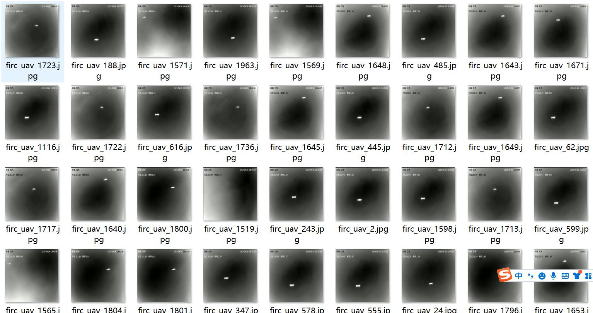
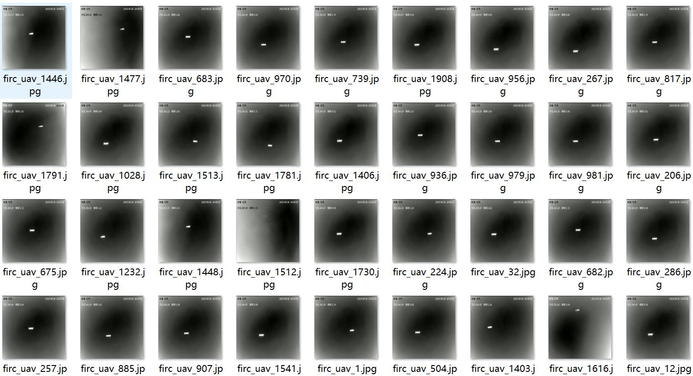
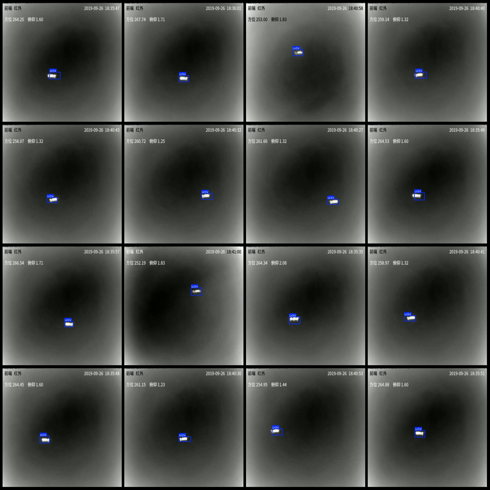
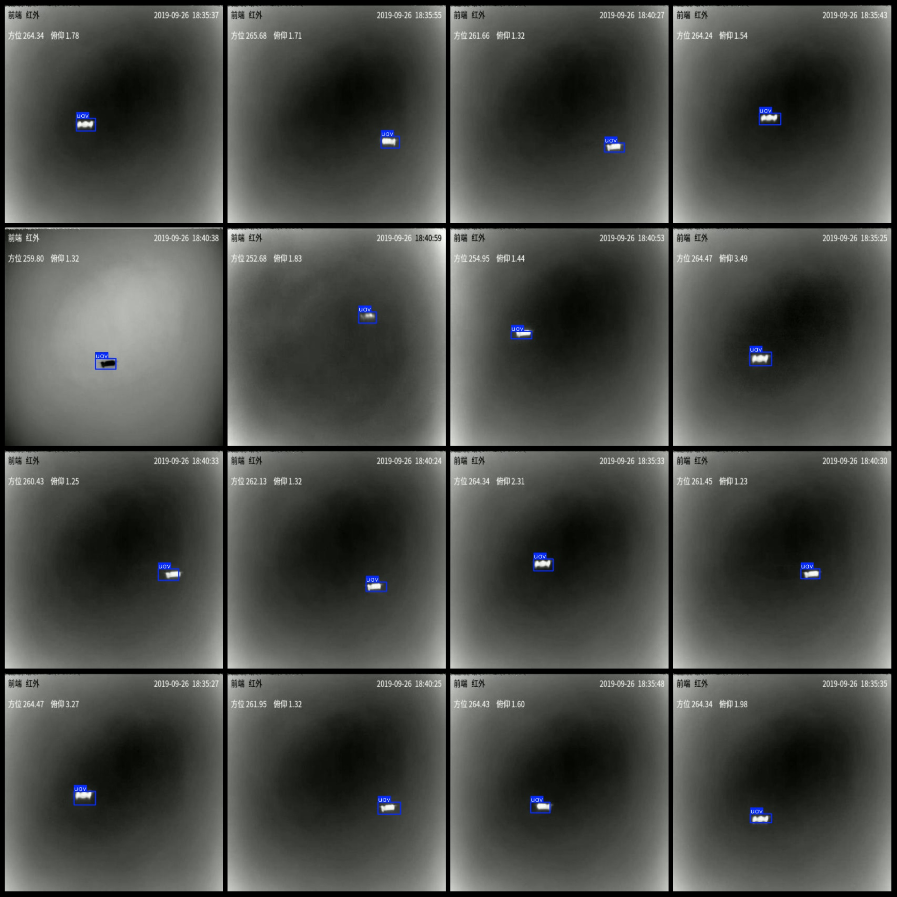

# Night Infrared Image Drone Detection Data Set VOC+YOLO Format, 1963 Images in One Category

Dataset format: Pascal VOC format + YOLO format (txt file without split path, only containing jpg images along with corresponding VOC format xml files and YOLO format txt files)
Number of images (jpg file count): 1963
Number of annotations (xml file count): 1963
Number of annotations (txt file count): 1963
Number of categories: 1
Annotation category name: ["uav"]
Number of bounding boxes per category:
uav = 1963
Total bounding boxes: 1963
Number of images per category:
uav = 1963
Image resolution: 640x640
Annotation tool used: labelImg
Annotation rules: draw a rectangle around the category
Special note: The dataset does not have separate training validation test sets to be split.
Special declaration: This dataset does not guarantee the accuracy of the trained models or weight files.
Image preview:
Annotation example:

## Images

Here is a pay link on Stripe ( https://buy.stripe.com/3cs8yP7sY87d0vu9AB ). Please contact me lonlonago@foxmail.com after funding $89, and I will send you a complete data files , thank you!

